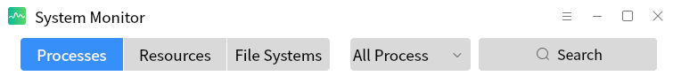
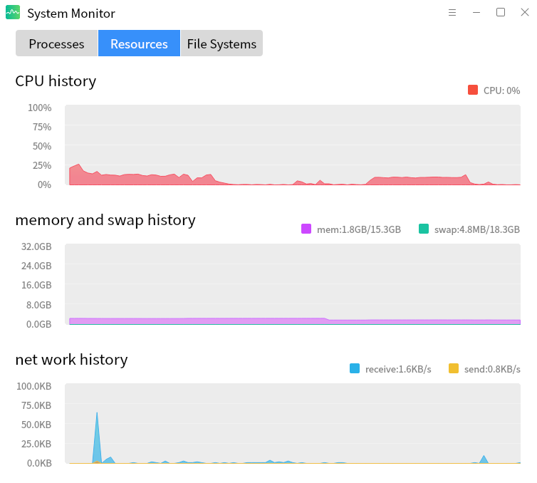

# Kylin System Monitor
## Overview
Kylin System Monitor is a professional application for monitoring system processes, system resources and file systems on domestic Galaxy Kylin and Ukylin. Through its concise and clear interface, it can intuitively display system-related information that users want to find.

 

## Title Bar
The title bar provides interface switching, drop-down box options and search box search functions.

- Users can switch processes, resources or file system interfaces according to their needs.

- Users can select the startup user and process category to switch the process, root user, current user or Other to the user, or whether the process is active or suspended.

 

## Processes
Display the process list and perform specified operations on the process.

Statistics show all started processes, and show their specific core information such as id, name, starting user CPU occupancy, memory, priority, disk IO rate and network flow consumption etc. And can execute functions such as killing, ending and continuing the process.

 

## Resources
Monitoring shows CPU, memory and swap space and system network traffic information.

### CPU History
The dynamic line graph counts the historical CPU usage, and the upper right label displays real-time CPU usage data.

### Memory and Swap Space History
The dynamic line graph counts the total historical occupation of the running memory and swap space of the system, and the label on the upper right shows the real-time occupation-Dosage and total amount.

### Net History
Dynamic line chart statistics system receives and sends historical data of traffic, the upper right shows real-time network receiving and network sending rate.

 

## File Systems
Count the list of mounted system partitions and the specific information of each partition.

- Monitor the number of partitions mounted to the system in real time and display them in a list.

- Display the mounted partition, mount path, file system type, file system capacity, file system free space and remaining space, etc.
