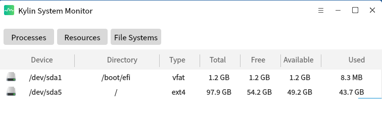
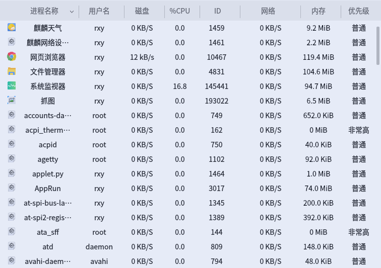
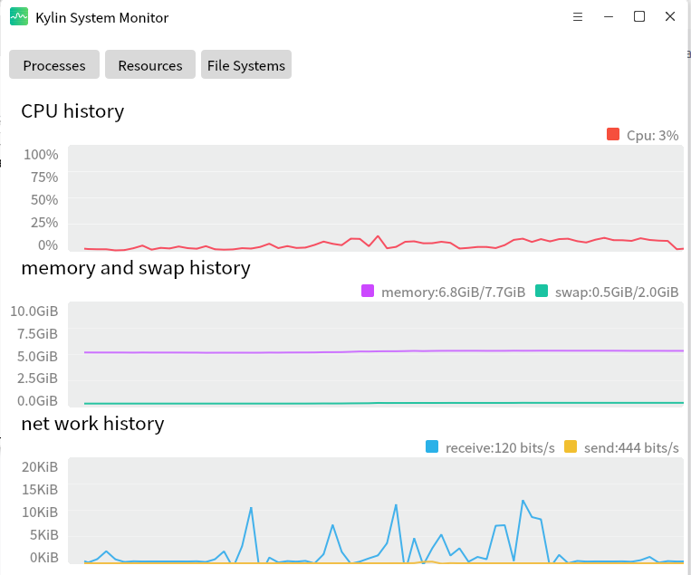
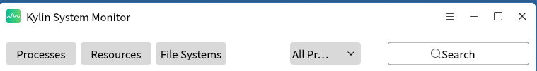

# 系统监视器
## 概 述 
系统监视器(ukui-system-monitor)是国产银河麒麟及优麒麟上监控系统进程，系统资源和文件系统的专业应用，通过其简洁明了的界面，可直观显示用户想要查找的系统相关信息。
 

## 标题栏功能
标题栏提供界面切换，下拉框选项和搜索框搜索功能。

 

### 界面切换
-用户按需求切换进程，资源或是文件系统界面。

### 下拉框选择进程列表类型
可以选择进程的启动用户以及进程类别对进程进行切换，root用户，当前用户或是

其他于用户，亦或是进程是活动的还是挂起的。

 

## 进程模块功能
显示进程列表以及对进程进行指定操作

 

### 显示指定列表
统计显示所有启动了的进程，并显示他们的具体核心信息，如id，名称，启动用户

CPU占用率，内存，优先级，磁盘IO速率以及网络流向消耗等。并且可对进程执行杀

死，结束以及继续等功能。

 

## 资源模块
监测显示CPU，内存和交换空间以及系统网络流量信息。

 

### CPU历史
动态折线图统计CPU历史占用率，右上方标签显示实时CPU占用率数据。

### 内存和交换空间历史
动态折线图统计系统运行内存和交换空间历史占用总量，右上方标签显示实时占占-

用量和总量。

### 网络历史
动态折线图统计系统接收和发送流量历史数据，右上方显示实时网路接收和网络发

送速率

 

## 文件系统模块功能
统计已挂载的系统分区列表以及每个分区的具体信息。

 

### 统计挂载到系统的内存分区
实时监测挂载到系统的分区数量，并已列表形式显示出来

### 显示挂载分区内容
显示挂载的分区，挂载路径，文件系统类型，文件系统容量，文件系统可用空间以

及剩余空间等功能
